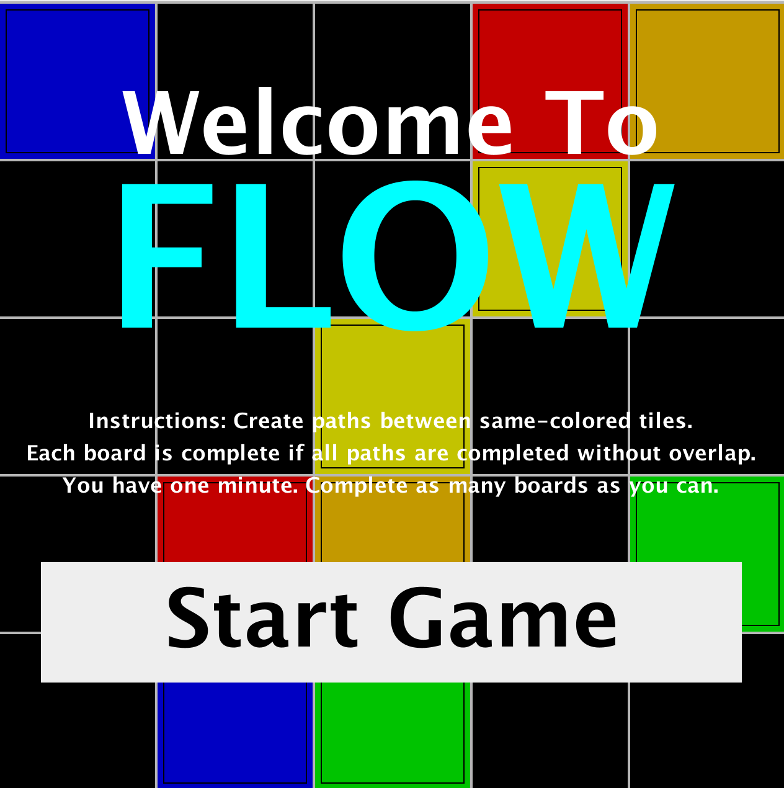
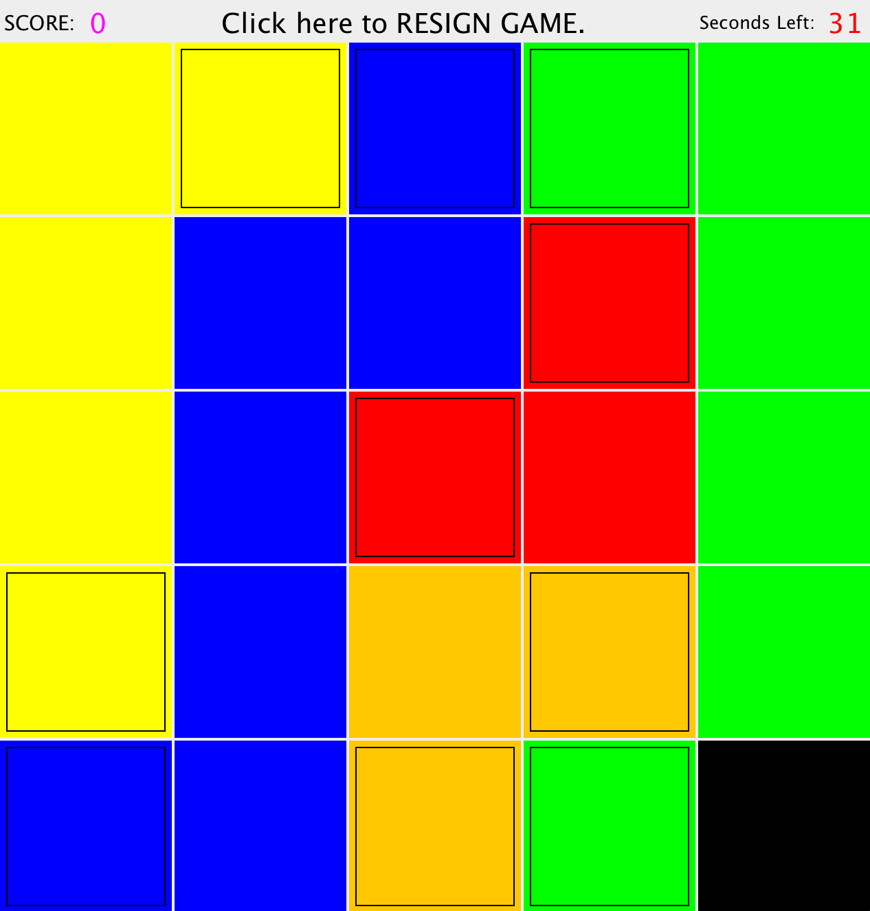
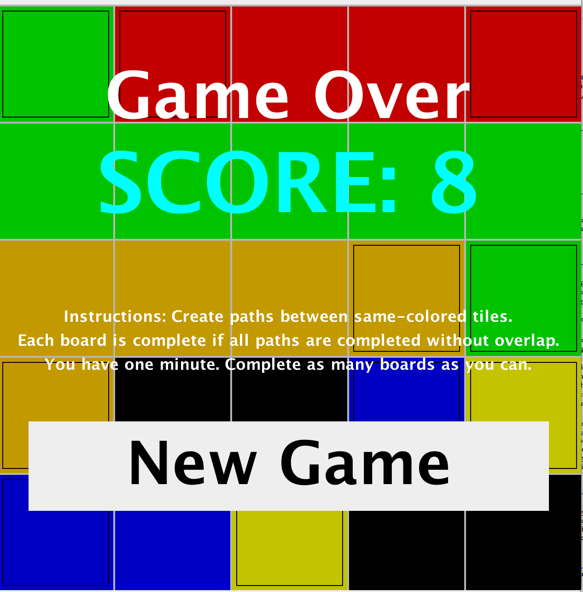

# Flow
This is a game similar to Flow on the appstore. It uses a Model-View-Controller structure, with a GUI using JFrame, JPanel, Action and Event Listeners.

To run:
1. Clone the repository 
2. While in your "flow" folder run the command: java -jar Flow.jar

Welcome to Flow. 

Connect matching paths to fill the game board.

Solve as many as you can in 1 minute.

Final project in AP CS 2015.
